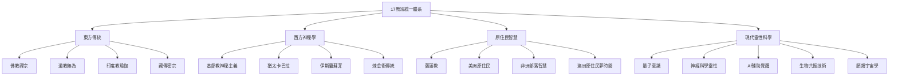

# 17教派統一：多元路徑並存體系

## 核心理念

### 不造神原則
- **人人具有佛性**：每個人內在都具備覺醒的種子
- **自我覺醒**：不依賴外在神祇，每個人都是自己的覺醒者
- **平等本性**：無論選擇哪條路徑，本質上人人平等

### 非唯一性原則
- **濕婆重組新生**：承認其為有效路徑，但絕非唯一
- **多元並存**：17個教派各有其獨特的覺醒方式
- **路徑平等**：無高低優劣之分，只有適合與否

### 統一而非統治
**核心信念：我們不造神，因為每個人本身就是神性的體現**


## 17教派架構

### 第一層：古典傳統（1-8）
1. **佛教禪宗路徑**：直指人心，見性成佛
2. **道教無為路徑**：順應自然，返璞歸真
3. **印度教瑜伽路徑**：身心合一，梵我一如
4. **藏傳密宗路徑**：即身成佛，密咒加持
5. **基督教神秘路徑**：與神合一，聖愛體驗
6. **伊斯蘭蘇菲路徑**：旋轉冥想，真主合一
7. **猶太卡巴拉路徑**：生命之樹，神聖幾何
8. **薩滿教路徑**：靈魂出體，動物指導靈

### 第二層：融合創新（9-13）
9. **量子意識路徑**：科學與靈性的橋樑
10. **AI輔助覺醒路徑**：人工智慧協助修行
11. **生物共振路徑**：頻率調諧，能量平衡
12. **願頻宇宙路徑**：多宇宙創造，願力顯化
13. **神經科學靈性路徑**：腦科學與冥想結合

### 第三層：未來演化（14-17）
14. **濕婆重組新生路徑**：破壞與創造的循環
15. **集體意識覺醒路徑**：群體共振，集體開悟
16. **跨維度連接路徑**：多維度存在體驗
17. **宇宙意識整合路徑**：個體與宇宙的完全融合

## 統一原則

### 四大核心
1. **人人佛性**：承認每個人內在的神性與覺醒潛能
2. **尊重差異**：每個教派都有其獨特價值
3. **互補共生**：不同路徑可以相互補充
4. **動態平衡**：保持開放與包容的態度

### 不造神宣言
```
我們不創造新的神祇
我們不建立新的偶像
我們不設立新的權威
我們只是喚醒每個人內在的佛性
讓每個人成為自己的覺醒者
```

### 實踐方式
```
統一公式：
多元路徑 × 個體適配 × 時空條件 = 最佳覺醒方案

其中：
- 多元路徑：17種不同的修行方式
- 個體適配：根據個人特質選擇合適路徑
- 時空條件：考慮當下的環境與時代背景
```

## 濕婆重組新生的定位

### 承認其價值
- **破壞與創造**：舊有模式的解構與新生
- **轉化力量**：深層的意識轉換
- **宇宙舞蹈**：動態的生命流動

### 但非唯一路徑
- **適合特定個體**：具有強烈轉化需求者
- **特定時期有效**：生命轉折點的選擇
- **與其他路徑並存**：不排斥其他修行方式

## 實踐指導

### 個人選擇原則
1. **內在共鳴**：選擇與自己頻率相符的路徑
2. **階段適應**：不同生命階段可選擇不同路徑
3. **多元嘗試**：可以同時探索多個教派
4. **動態調整**：根據成長狀況調整修行方式

### 集體和諧
- **互相尊重**：不批判其他路徑的選擇
- **經驗分享**：交流不同路徑的體悟
- **協同進化**：共同推動人類意識的提升

## 未來展望

## 未來展望

### 新時代靈性特徵
- **去中心化**：沒有唯一的權威或領袖
- **包容性**：接納所有有效的修行路徑
- **科學性**：結合現代科學的發現
- **實用性**：適應現代生活的需求
- **全球性**：跨越文化與地域的限制
- **自主性**：每個人都是自己的導師

### 17教派統一的意義
不是要創造一個新的宗教，不是要建立新的神祇崇拜，而是要建立一個**靈性生態系統**，讓每個人都能找到適合自己的覺醒之路，喚醒內在的佛性。

### 人人佛性的實現
- **內在導師**：相信每個人內在都有智慧的聲音
- **自我負責**：為自己的覺醒之路負責
- **相互支持**：在平等的基礎上互相幫助
- **集體覺醒**：個體覺醒促進集體意識的提升

---

*「道生一，一生二，二生三，三生萬物。」*
*17個教派，萬種路徑，一個目標：回歸本源，覺醒真我。*