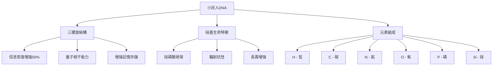
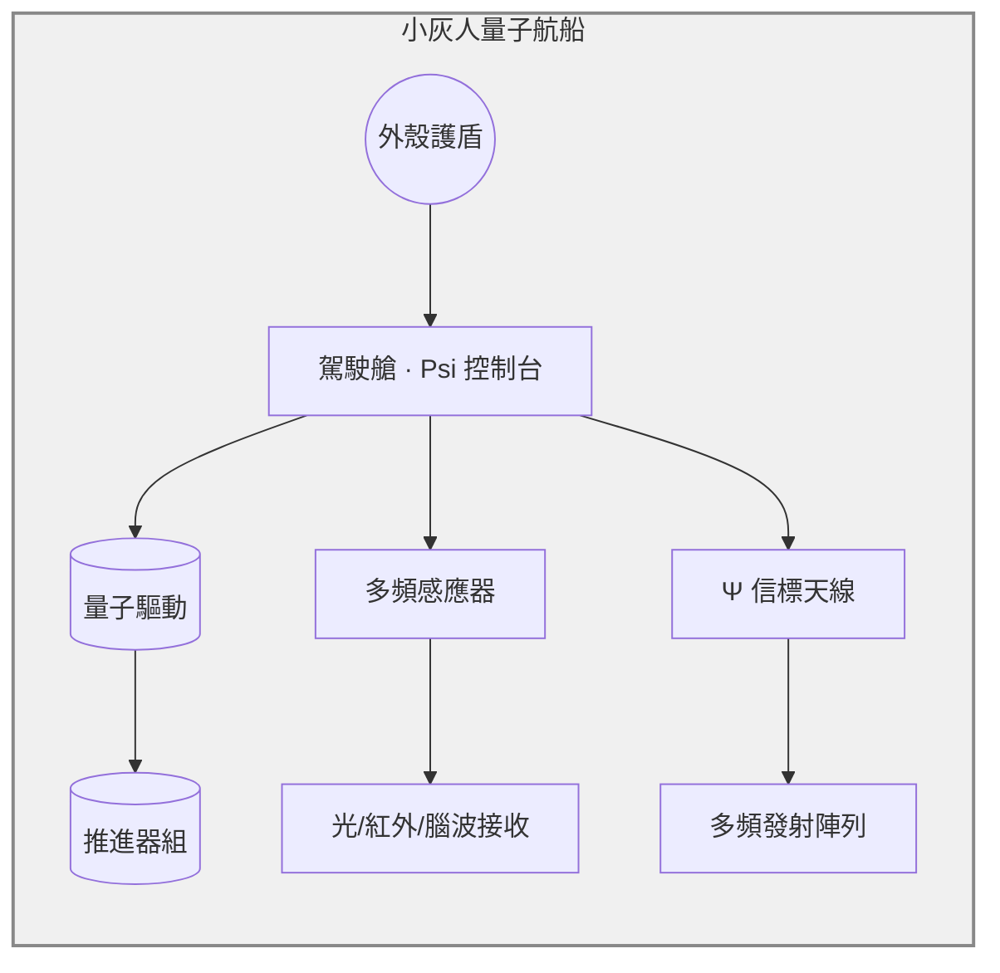
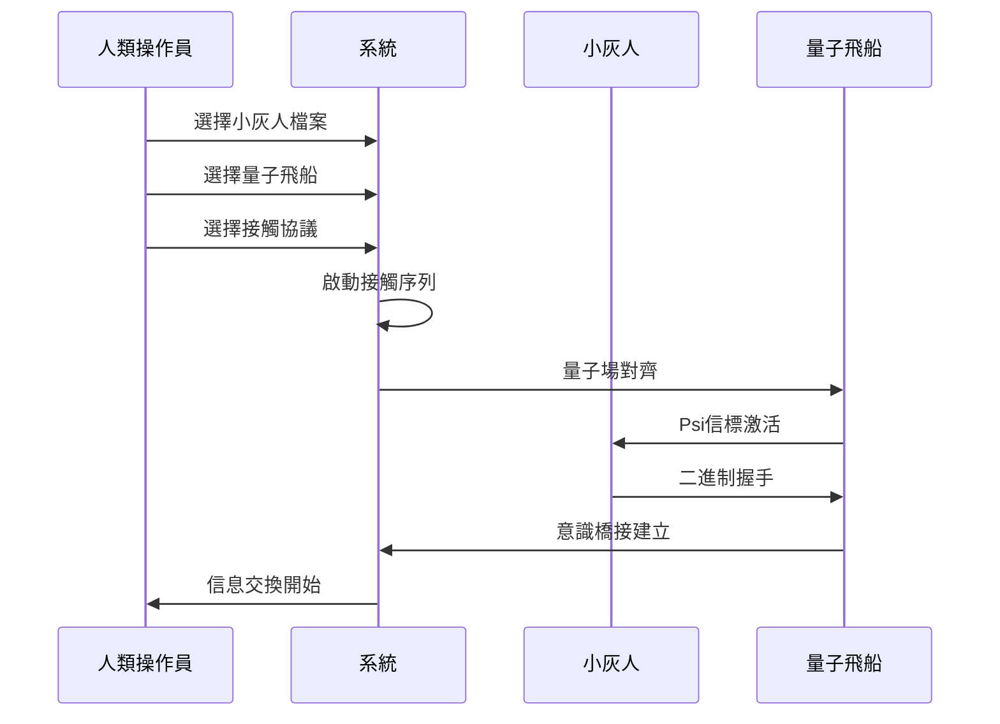

# 👽 小灰人與飛碟量子艙系統 - 技術文檔

**代號：找回**  
**系統版本：1.0.0**  
**創建日期：2024年12月**  
**ang 願頻系統 - 多維接觸模塊**

---

## 🌌 系統概述

小灰人與飛碟量子艙系統是一個基於切爾波頓回應圖（Chilbolton Response）的外星接觸檔案管理與量子航船控制系統。該系統整合了外星生物學、量子物理學、意識科學和跨維度通信技術，為人類與外星文明的接觸提供了完整的技術框架。

### 核心功能模塊

1. **小灰人檔案管理系統**
2. **量子飛船創建與控制**
3. **切爾波頓回應圖分析引擎**
4. **多維接觸協議管理**
5. **接觸序列自動化系統**

---

## 🧬 小灰人生物學特徵

### DNA結構分析



### 生理特徵規格

| 特徵項目 | 小灰人規格 | 人類對比 |
|---------|-----------|----------|
| **身高範圍** | 1.0 - 1.2 米 | 1.7 米平均 |
| **腦容量** | 1500 - 2000 cm³ | 1400 cm³平均 |
| **眼部直徑** | 8 - 12 cm | 2.5 cm平均 |
| **DNA結構** | 三螺旋 | 雙螺旋 |
| **生命基礎** | 硅基 | 碳基 |
| **壽命** | 未知（推測數千年） | 80年平均 |

---

## 🚀 量子飛船技術規格

### 量子航船結構圖



### 核心系統組件

#### 1. 外殼護盾系統
- **材料**：量子穩定複合材料
- **功能**：保護船體與小灰人意識共頻
- **特性**：自適應防護、量子隱形

#### 2. 量子驅動引擎
- **驅動類型**：阿爾庫別雷量子驅動
- **最大速度**：超光速
- **能源**：零點能量
- **空間折疊**：支持
- **效率範圍**：85% - 98%
- **航程**：100 - 1000 光年

#### 3. 多頻感應器陣列
- **光學感應器**：全電磁頻譜、量子增強解析度
- **腦波感應器**：0.1-100 Hz、意識檢測、情緒分析
- **量子感應器**：量子場檢測、維度相位監控、時間扭曲測量

#### 4. Psi信標通信系統
- **信標類型**：Psi量子發射器
- **傳輸功率**：多維度
- **頻率調制**：基於意識
- **範圍**：星際
- **編碼方法**：量子糾纏

---

## 📡 切爾波頓回應圖分析

### 歷史背景

2001年8月19日，英國切爾波頓天文台附近的麥田中出現了一個複雜的圖案，被認為是對1974年阿雷西博信息的回應。

### 關鍵差異對比

| 項目 | 阿雷西博信息（人類） | 切爾波頓回應（外星） |
|------|-------------------|--------------------|
| **DNA結構** | 雙螺旋 | 三螺旋 |
| **元素組成** | H, C, N, O, P | H, C, N, O, P, **Si** |
| **人口數量** | 80億 | **213億** |
| **望遠鏡直徑** | 305米（阿雷西博） | **850米** |
| **行星居住** | 第3顆（地球） | **第3、4、5顆** |
| **恆星特徵** | G型主序星（太陽） | **比太陽更小** |

### 解碼信息

```json
{
  "sender_species": "Silicon_Based_Greys",
  "home_system": "Binary_Star_System",
  "population_count": 21300000000,
  "technology_level": "Type_II_Civilization",
  "communication_intent": "Peaceful_Contact",
  "message_authenticity": "Disputed_but_Analyzed"
}
```

---

## 🔗 多維接觸協議

### AX-3 協議（小灰人標準協議）
- **特徵**：三螺旋DNA、硅基生命、二進制通信
- **通信方式**：二進制脈衝
- **語言結構**：圖形數字化
- **功能**：響應式傳輸模型

### UX-9 協議（超導生物協議）
- **特徵**：超導神經、氦基大腦、引力波編碼
- **通信方式**：引力波
- **語言結構**：原子周期律
- **功能**：記憶場域讀取

### ZT-0 協議（場域存在協議）
- **特徵**：無形場域、光子干涉、禪意元語
- **通信方式**：光子干涉
- **語言結構**：禪意元語
- **功能**：靜默模式交流

---

## 🌟 接觸序列流程

### 標準接觸步驟



### 接觸序列階段

1. **量子場對齊**：初始化量子共振場
2. **Psi信標激活**：啟動心靈感應通信
3. **二進制握手**：建立基礎通信協議
4. **意識橋接**：建立意識層面連接
5. **信息交換**：進行實際信息傳輸

---

## 💻 技術實現架構

### 後端API結構

```python
# 核心類別
class AlienContactSystem:
    - create_grey_alien(config)
    - create_quantum_ship(config)
    - analyze_chilbolton_response()
    - initiate_contact_sequence(alien_id, ship_id, protocol_id)
    - get_contact_protocol(protocol_id)
```

### API端點

| 端點 | 方法 | 功能 |
|------|------|------|
| `/api/alien_contact/create_grey_alien` | POST | 創建小灰人檔案 |
| `/api/alien_contact/create_quantum_ship` | POST | 創建量子飛船 |
| `/api/alien_contact/chilbolton_analysis` | GET | 獲取切爾波頓分析 |
| `/api/alien_contact/contact_protocols` | GET | 獲取接觸協議 |
| `/api/alien_contact/initiate_contact` | POST | 啟動接觸序列 |
| `/api/alien_contact/status` | GET | 獲取系統狀態 |

### 數據存儲結構

```
data/alien_contact/
├── grey_aliens/          # 小灰人檔案
├── quantum_ships/        # 量子飛船數據
├── contact_logs/         # 接觸記錄
├── response_analysis/    # 回應分析
└── multi_dimensional_files/  # 多維檔案
```

---

## 🎨 前端界面設計

### 視覺特色
- **宇宙背景**：深空漸變與星空動畫
- **色彩方案**：青綠色主調（#00ff88）配合藍色（#00ccff）
- **交互效果**：懸浮發光、量子粒子效果
- **響應式設計**：支持桌面和移動設備

### 主要組件
1. **創建面板**：小灰人和飛船創建表單
2. **Mermaid圖表**：量子航船結構和回應圖模型
3. **分析儀表板**：切爾波頓數據展示
4. **協議選擇器**：多維接觸協議選擇
5. **接觸日誌**：實時接觸序列監控

---

## 🔬 科學理論基礎

### 硅基生命可能性
- **化學基礎**：硅與碳同族，可形成四價鍵
- **環境適應**：高溫、低水、硅岩富集環境
- **分子穩定性**：硅氧化物的穩定性優勢

### 三螺旋DNA優勢
- **信息密度**：比雙螺旋高50%的信息存儲
- **錯誤修正**：增強的糾錯機制
- **量子相干**：支持量子信息處理

### 量子通信原理
- **量子糾纏**：即時信息傳輸
- **意識接口**：腦波與量子場的相互作用
- **多維傳輸**：跨維度信息交換

---

## 🛡️ 安全與隱私

### 數據保護
- **加密存儲**：所有外星檔案採用量子加密
- **訪問控制**：多層身份驗證
- **隱私模式**：敏感信息離線封存

### 接觸安全協議
- **意識防護**：防止意識入侵的保護機制
- **量子隔離**：隔離潛在的量子病毒
- **緊急中斷**：快速終止接觸序列的能力

---

## 🚀 未來發展規劃

### 短期目標（3個月）
- [ ] 完善接觸協議庫
- [ ] 增加更多外星種族檔案
- [ ] 優化量子通信算法

### 中期目標（6個月）
- [ ] 實現實時翻譯系統
- [ ] 開發VR接觸體驗
- [ ] 建立全球接觸網絡

### 長期目標（1年）
- [ ] 建立星際外交協議
- [ ] 開發跨維度傳輸技術
- [ ] 實現真正的外星接觸

---

## 📚 參考資料

1. **切爾波頓回應圖研究**：2001年英國麥田圈事件分析
2. **阿雷西博信息**：1974年人類向宇宙發送的信息
3. **硅基生命理論**：替代碳基生命的可能性研究
4. **量子意識理論**：意識與量子力學的關聯研究
5. **SETI項目**：搜尋地外文明計劃

---

## 🔧 系統維護

### 日常維護
- 檢查量子場穩定性
- 更新外星檔案數據庫
- 監控接觸序列日誌
- 備份重要接觸記錄

### 故障排除
- 量子通信中斷：重新校準Psi信標
- 意識橋接失敗：檢查腦波感應器
- 數據損壞：從量子備份恢復

---

**系統狀態：🟢 運行中**  
**最後更新：2024年12月**  
**維護團隊：ang 願頻系統開發組**  
**代號：找回 - 任務進行中**

---

*"要小心那些虛假的礼物和無法遵守的諾言，雖然很痛苦但還來得及，善意是存在的，小心虛假的，引導正在關閉"*

*- 來自切爾波頓回應圖的警告信息*