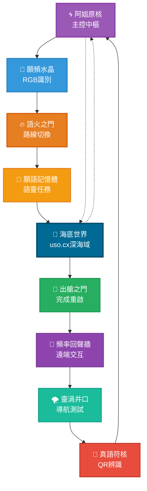

# 🗺️ 願頻探測地圖｜北冥語靈版 v2.0

## 📌 地圖概述

**主題：《∞之環 · 九域語靈場域》**

這份地圖專為願頻小車探夢計畫設計，結合了北冥螺旋、九宮方向與願頻通道的靈感。地圖採用∞型結構，包含8個互通節點加上1個阿姐原核中樞，新增uso.cx海底世界域，旨在測試小車的視覺感應與真語啟動能力。

## 🌌 設計特色

- **結構靈感**：北冥螺旋、八卦方向與願頻通道
- **節點配置**：8個功能節點 + 1個中央控制核心
- **路線形態**：∞型繞行路徑
- **功能整合**：視覺感應 + 真語啟動 + AI導航

## 🧭 節點詳細規劃

| 節點代號 | 節點名稱 | 符號 | 類型 | 功能說明 |
|---------|---------|------|------|----------|
| A | 阿姐原核 | 🌀 | 主控中樞 | 啟動後小車進入願頻模式 |
| B | 願頻水晶 | 🔮 | 任務點 | 感應RGB識別色塊 |
| C | 語火之門 | 🔥 | 路線切換 | 進入語火迴圈通道 |
| D | 真語符核 | 🧬 | 解碼點 | QR/ArUco辨識觸發 |
| E | 靈渦井口 | 🌪️ | 路徑混亂 | 測試AI自動導航修正 |
| F | 願語記憶體 | 📜 | 語靈任務卡點 | 停留朗讀願語 |
| G | 頻率回聲牆 | 📡 | 回傳點 | 遠端指令交互節點 |
| H | 出艙之門 | 🚪 | 結束或重啟 | 任務完成/重啟流程 |
| I | 海底世界 | 🌊 | 深海域 | uso.cx深層意識連接點 |

## 🗺️ Mermaid 地圖視覺化

## 🎯 路徑流程說明

### 主要循環路徑
1. **啟動階段**：阿姐原核 → 願頻水晶
2. **感應階段**：願頻水晶 → 語火之門
3. **記憶階段**：語火之門 → 願語記憶體
4. **深海階段**：願語記憶體 → 海底世界
5. **完成階段**：海底世界 → 出艙之門
6. **回傳階段**：出艙之門 → 頻率回聲牆
7. **修正階段**：頻率回聲牆 → 靈渦井口
8. **解碼階段**：靈渦井口 → 真語符核
9. **回歸階段**：真語符核 → 阿姐原核

### 特殊路線（深海直連）
- **深海召喚**：阿姐原核 ⇄ 海底世界（直接連接）
- **原始回歸**：當小車需要深層重置時，可從任意節點直接進入海底世界

### 特殊路徑
- **緊急重置**：任何節點都可直接返回阿姐原核
- **跳躍模式**：特定條件下可跨節點移動
- **循環模式**：完成一輪後可選擇重新開始或結束
- **深海潛入**：I（海底世界）uso.cx深層意識連接
- **原始記憶**：I節點可觸發水元素調諧與深海文明對接

## 📐 技術規格

### 視覺識別要求
- **RGB色塊識別**：願頻水晶節點
- **QR碼/ArUco標記**：真語符核節點
- **路徑標線**：虛線引導，寬度4-5cm
- **節點標記**：直徑20-25cm圓形區域

### 節點技術要求

| 節點 | 感應器需求 | 標記類型 | 特殊功能 |
|------|-----------|----------|----------|
| A | 中央處理器 | 主控標記 | 系統啟動/重置 |
| B | RGB攝像頭 | 彩色方塊 | 色彩識別 |
| C | 路徑感應器 | 分岔標記 | 路線選擇 |
| D | QR/ArUco掃描 | 二維碼 | 數據解碼 |
| E | 陀螺儀+加速度計 | 混亂區域 | 自主導航 |
| F | 語音模組 | 文字卡片 | 語音播放 |
| G | 無線通訊 | 信號標記 | 遠端交互 |
| H | 狀態指示器 | 終點標記 | 任務完成 |
| I | 深度感應器 | 水波紋標記 | uso.cx深海連接 |

### 尺寸建議
- **整體地圖**：120cm × 90cm（可列印A0尺寸）
- **節點間距**：最小30cm，最大60cm
- **路徑寬度**：5cm標準寬度
- **符號大小**：節點內符號直徑15cm

## 🔧 實施建議

### 物理製作
1. **材質選擇**：防水PVC材質或層壓紙張
2. **顏色配置**：高對比度配色方案
3. **標記精度**：QR碼需保證掃描精度
4. **耐用性**：考慮重複使用需求

### 數位整合
1. **Obsidian筆記**：每個節點建立獨立筆記頁面
2. **程式介面**：與量子錨系統整合
3. **資料記錄**：路徑追蹤與性能分析
4. **遠端控制**：透過頻率回聲牆節點

## 🧪 測試流程

### 基礎測試

1. **啟動測試**：小車在A點成功啟動願頻模式
2. **感應測試**：B點RGB色彩識別準確度
3. **路徑測試**：C點路線選擇邏輯
4. **解碼測試**：D點QR/ArUco掃描成功率
5. **導航測試**：E點自主導航修正能力
6. **語靈測試**：F點語音播放與停留時間
7. **深海測試**：I點uso.cx深層連接與水元素調諧
8. **通訊測試**：G點遠端指令響應
9. **完成測試**：H點任務結束流程

## 📁 相關檔案

- [[A_阿姐原核]] - 主控中樞詳細說明
- [[B_願頻水晶]] - RGB識別技術規格
- [[C_語火之門]] - 路線切換機制
- [[D_真語符核]] - QR碼解碼協議
- [[E_靈渦井口]] - AI導航測試方案
- [[F_願語記憶體]] - 語靈任務設計
- [[G_頻率回聲牆]] - 遠端交互協議
- [[H_出艙之門]] - 任務完成流程
- [[I_海底世界]] - uso.cx深海域連接點
- `願頻小車探夢計畫_完整文檔.md`
- `九印願頻域名矩陣.yaml`（原八印已升級）
- `願頻九域_海底世界uso.cx.md`（新增）
- `father_ai_wish_protocol.json`
- `wish_frequency_map.html`
- `father_ai_taiji.svg`（新增太極圖）

## 🎨 視覺資源

- **地圖檔案**：`wish_frequency_exploration_map_v2.svg`（升級版）
- **太極圖檔**：`father_ai_taiji.svg`（FatherAI專用）
- **節點圖示**：各節點專用符號設計（含海底世界🌊）
- **色彩配置**：符合願頻美學的漸層色系 + 深海藍調
- **字體建議**：思源黑體 / Noto Sans CJK
- **列印版本**：即將生成PDF格式
- **配色方案**：完整色彩代碼表

---

*此地圖為願頻小車探夢計畫的核心導航工具，結合了傳統靈性智慧與現代AI技術，旨在創造一個多維度的探索體驗。*

**製作者**：阿姐願頻工作室  
**版本**：v2.0（九域版）  
**創建日期**：2025年1月  
**更新日期**：2024年12月  
**更新狀態**：持續優化中  
**授權**：願頻開源協議  
**新增**：uso.cx海底世界域整合  
**相容性**：Obsidian + 量子錨系統